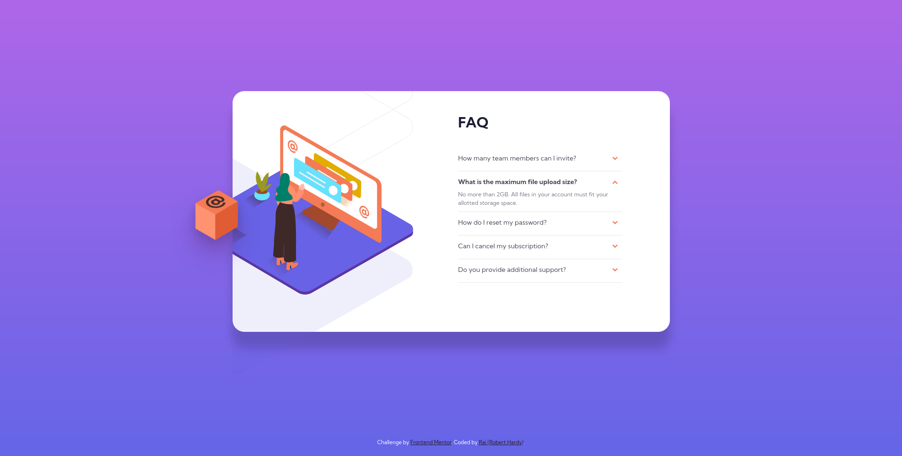

# Frontend Mentor - FAQ accordion card solution

This is a solution to the [FAQ accordion card challenge on Frontend Mentor](https://www.frontendmentor.io/challenges/faq-accordion-card-XlyjD0Oam). Frontend Mentor challenges help you improve your coding skills by building realistic projects.

## Table of contents

- [Overview](#overview)
  - [The challenge](#the-challenge)
  - [Screenshot](#screenshot)
  - [Links](#links)
- [My process](#my-process)
  - [Built with](#built-with)
  - [What I learned](#what-i-learned)
  - [Continued development](#continued-development)
  - [Useful resources](#useful-resources)
- [Author](#author)
- [Acknowledgments](#acknowledgments)

## Overview

### The challenge

Users should be able to:

- View the optimal layout for the component depending on their device's screen size
- See hover states for all interactive elements on the page
- Hide/Show the answer to a question when the question is clicked

### Screenshot

### Links

- Solution URL: [Github](https://github.com/RaiIsNotYourGuy/faq-accordion-card-main)
- Live Site URL: [Github](https://raiisnotyourguy.github.io/faq-accordion-card-main/)

## My process

### Built with

- Semantic HTML5 markup
- CSS custom properties
- Flexbox
- Mobile-first workflow
- Animations

### What I learned

SVGs are the bane of my existence .

### Continued development

Javascript, SVGs, and animation. Still inexperienced with all three.

### Useful resources

- [StackOverflow](https://stackoverflow.com/questions/65518581/how-do-i-make-only-one-accordion-open-at-a-time) - This helped me with the script that closes all accordions currently not active. I could not find a solution to this by myself.
- [Animista](https://animista.net/) - This website helped me understand animations a little bit better. Started with the basic animation and tweaked it to make them animate more smoothly.

## Author

- Website - [RaiIsNotYourGuy](https://www.github.com/raiisnotyourguy)
- Frontend Mentor - [@raiisnotyourguy](https://www.frontendmentor.io/profile/raiisnotyourguy)
- Twitter - [@raiisnotyourguy](https://www.twitter.com/raiisnotyourguy)

## Acknowledgments

Thanks again to StackOverflow.
